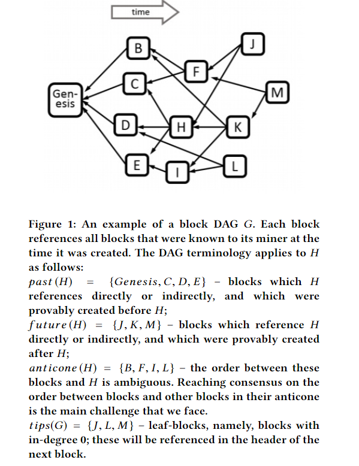
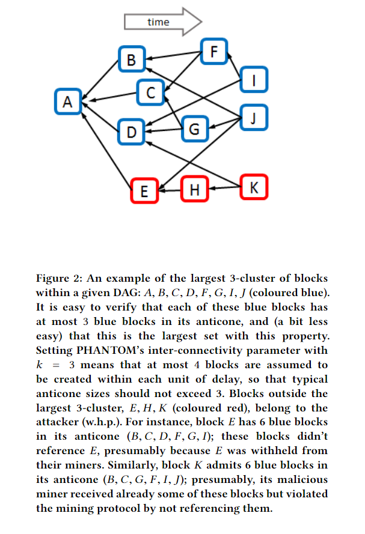

# PHANTOM GHOSTDAG

## 这是PHANTOM GHOSTDAG论文的中文翻译，再次感谢作者。

## 摘要

在2008年，中本聪发明了基于区块链技术的分布式账本的基础理论。这一系统的核心部分是一个由节点（或者叫矿工）构成的公开的，匿名的网络来维护一个公共的交易账本。账本采用区块链的形式，每一个区块是用户的一批交易。中本聪的区块链最主要的问题是扩展性极度被限制。中本聪的最长链原则，也就比特币协议的安全性要求在其他节点产生新的区块后，所有的诚实的节点需要尽快知悉这个区块。为了这一目的，这个系统的吞吐量被人为的压低，从而使得新产生的区块在下一个区块产生之前被充分的广播，也可以保证极少的导致链上分叉的孤儿块被无意的创建。

在这篇论文中我们阐述了PHANTOM协议，另外一种创建无许可账本的协议。它基于工作量证明，将中本聪的区块链扩展到由区块构成的有向无环图（区块图）。PHANTOM协议包含一个参数k，用来控制对网络上同时产生的区块的数目的容忍程度。这个参数可以被调整以适应高吞吐量。它也避免了在安全性和扩展性之间的取舍，而这是中本聪协议不能避免的。

PHANTOM解决了一个区块图（blockDAG）上的一个优化问题，从而可以区分由诚实的节点铸造的区块和由不合作的节点铸造的区块，这些不合作的节点往往想偏离挖矿协议。通过这个区分，PHATOM协议提供了一种在区块图（blockDAG）上实现稳定的全排序的方法，这种方法可以使全排序的结果最终在所有的诚实节点上达成一致。实现PHANTOM协议需要解决一个NP-hard（NP难）的问题。因此，为了避免高昂的计算代价，我们想出了一种高效的贪心算法GHOSTDAG，这种算法的本质和PHANTOM是一致的。

GHOSTDAG协议是实现kaspa加密货币的底层技术。kaspa网络提供产生在现实场景下GHOSTDAG性能的统计数据。通过观察kaspa网络获取了网络确认时间的数据，我们分析了这些数据。我们也对GOHSTDAG协议的安全性进行了形式上的证明。也就是说，我们证明了在一个指数级别可以忽略的参数限制下，GHOTSDAG的区块的排序是不可逆的。我们讨论了GHOSTDAG的性质，并把它和其他基于有向无环图（DAG）的协议做了比较。

## 1 简介

<!--
The security of the Bitcoin protocol relies on blocks propagating
quickly to all miners in the network [9, 14, 19]. Block creation
itself is slowed down via the requirement that each block contain
a proof-of-work. For the Bitcoin protocol to be secure, block
propagation must be faster than the typical time it takes the network
together to create the next block. In order to guarantee this property,
the creation of blocks in Bitcoin is regulated by the protocol to occur
only once every 10 minutes, and the block size itself is limited to
allow for fast transmission. As a result, Bitcoin suffers from a highly
restrictive throughput on the order of 3-7 transactions per second
(tps).
-->

比特币协议的安全性依赖于将区块快速的传播给网络中的矿工。由于要求区块包含工作量证明，所以区块的创建速度变慢了。为了保证比特币协议的安全，区块传播要比整个网络通常创建一个区块的时间要快。为了保证这一网络的性质，在比特币协议中规定了区块的创建每隔十分钟发生一次，并且限制了区块的大小，使得区块可以快速传输。因此，比特币的吞吐量被极大的抑制，每秒钟大概只有3到7笔交易。

<!--
the PHANTOM protocol. In this paper we present PHANTOM,
a protocol that generalizes Nakamoto’s longest chain protocol. In
Bitcoin, blocks reference a single predecessor in the chain, hence
form a tree; in contrast, PHANTOM blocks reference multiple
predecessors, thus forming a Directed Acyclic Graph, a blockDAG.
Each block can thus include several hash references to predecessors.
PHANTOM then provides a total ordering over all blocks and
transactions, and outputs a consistent set of accepted transactions.
Unlike the Bitcoin protocol, where blocks that are not on the main
chain are discarded, PHANTOM incorporates all blocks in the
blockDAG into the ledger, but places blocks that were created by
attackers later in the order.
-->

*PHANTOM协议* 在这篇论文中我们描述了PHANTOM协议，这个协议扩展了中本聪的最长链协议。在比特币中，区块引用一个链上的父节点，因此，构成了一个树的结构。与此对比之下，PHANTOM协议引用了多个父节点，因此形成了一个有向无环图，也称作blockDAG。每一个区块因此可以包含多个父节点的哈希引用。PHANTOM然后提供了一种对所有区块和交易的全排序，输出一个一致的被接收的交易的集合。不像在比特币协议中，所有的不在主链上的区块都会被忽略，PHANTOM吸收所有在blockDAG中的区块到账本中，但同时将恶意攻击者创建的区块放在排序的后面。

<!--
In rough terms, PHANTOM consists of a three-step procedure:
(1) Using the structure of the blockDAG, we recognize a set
of well-connected blocks (we later refer to these as blue
blocks); this procedure is used to exclude blocks created by
misbehaving nodes and is the heart of the protocol: Blocks
that either reference only old blocks from the DAG, or are
withheld by their creator for some time, will be excluded
from the set of blue blocks with high probability.
(2) We complete the DAG’s naturally induced partial order
to a full topological one (i.e., an order which respects the
topology) in a way that favours blocks inside the selected
cluster and penalizes those outside it.
(3) The order over blocks induces an order over transactions;
transactions in the same block are ordered according to
the order of their appearance in the block. We iterate over
all transactions in this order, and accept each one that is
consistent (according to the underlying consistency notion)
with all transactions approved so far.
-->

粗略的来讲，PHANTOM协议包含三个步骤。
（1）通过使用blockDAG结构，我们识别一个由良好连接的区块构成的集合（这些良好连接的区块我后面通过蓝色来标记）。这个过程被用来提出恶意节点产生的区块。那些指引用老节点的区块和那些被创建者扣留一段时间的区块很大概率会被从蓝色的区块剔除。
（2）我们通过偏序顺序得到一个全拓扑的顺序（这个排序不改变拓扑结构）。在排序的过程中，奖励蓝色集合的区块，惩罚蓝色集合以外的区块。
（3）区块的顺序决定了交易的顺序。在同一区块中的交易，顺序由交易在区块中出现的时间顺序决定。我们按照这个顺序遍历所有的交易，并接受与历史上的交易相一致（依赖底层的一致性原则）的交易。

<!--
Propagation delay. The first step above involves assuming
an upper bound on the network’s delay diameter D, and
parameterizing the protocol accordingly; k denotes this parameter.
Such an assumption is made in Nakamoto Consensus as well. In fact,
if PHANTOM is set to process low throughput, we can set k =0,
in which case PHANTOM coincides with Nakamoto Consensus.
However, while Nakamoto Consensus suppresses the throughput
and sets the block creation rate λ such that D ·λ ≪1, PHANTOM
does not impose an a priori constraint over λ. Instead, the
throughput (in terms of λ and the block size) can be set to approach
the network’s capacity, and then k can be set after the fact to ensure
the safety of the protocol. This alleviates the security-scalability
tradeoff that Nakamoto Consensus suffers. Still, increasing k does
not come without cost, as we will discuss shortly.
-->

*传输延迟* 上面的第一步需要假设整个网络有一个延迟半径$D$的上限，并且根据这个上限确定协议中的参数。$k$就是这个参数。中本聪协议中也有这个假设。事实上，如果让PHANTOM处理很低的吞吐量，我们可以将$k$设置为0，在这种情况下，PHANTOM协议和中本聪协议是一致的。但是，中本聪协议压低了吞吐量，它将出块速度$\lambda$设置为$D \cdot \lambda \ll 1$。但是PHANTOM协议并不对$\lambda$进行预设。相反，吞吐量（由$\lambda$和区块大小决定）可以设置达到网络容量，在达到这一前提下可以设置$k$确保协议的安全性。这缓解了安全性和扩展性顾此失彼的权衡困境，而这是中本聪协议不得不面对的。然而，增加$k$并不是没有代价的，我们将简要的讨论这一问题。

<!--
GHOSTDAG. In its vanilla form, PHANTOM requires solving
an NP-hard problem, and is therefore unsuitable for practical
applications. Instead, we use the intuition behind PHANTOM to
devise a greedy algorithm, GHOSTDAG, which can be implemented
efficiently. We prove formally that GHOSTDAG is secure, in the
sense that its ordering of blocks becomes exponentially difficult to
reverse as time develops.
-->

*GHOSTDAG* 在基础的形式下，PHANTOM需要解决一个NP难的问题，因此并不适用于实际的应用场景。但是，我们通过把握PHANTOM协议的实质实现了一种贪心算法，这种算法可以被高效的实现。我们在逻辑上证明了GHOSTDAG是安全的。这个安全是指随着时间的增加，要回滚区块的排序的难度是指数级别增加的。

<!--
The main achievement of GHOSTDAG can be summarized as
follows:
Theorem (Informal). Given two transactions tx1,tx2 that were
published and embedded in the blockDAG at some point in time,
the probability that GHOSTDAG’s order between tx1 and tx2 changes
over time decreases exponentially as time grows, even under a high
block creation rate that is non-negligible relative to the network’s
propagation delay, assuming that a majority of the computational
power is held by honest nodes.
We will reformalize this theorem in Section 3, and provide a
formal proof in Appendix A.
We now proceed to describe the PHANTOM and GHOSTDAG
protocols more formall
-->

GHOSTDAG的成果可以被总结为以下内容：
在理论（形式）上，给定两个已经发布并写入blockDAG的交易，tx1和tx2，在GHOSTDAG协议中，随着时间的增加，tx1和tx2
两个交易的相对顺序的改变的概率是指数级别递减的，即使在一个很高的区块的创建速度下也是如此。这个很快是指在当大部分算力被诚实的节点掌握的时候，产生一个区块的时间与网络传输的延迟相比是不可忽略的。我们将在第三节再次阐述这个理论，并且在附录A中提供了一个形式化的证明。

## 2 PHANTOM协议
### 2.1 前置内容 

<!--
The following terminology is used extensively throughout this
paper. A DAG of blocks is denoted G =(C,E), where Crepresents
blocks and E represents the hash references to previous blocks. We
frequently write B ∈G instead of B ∈ C. past (B,G) ⊂ Cdenotes
the subset of blocks reachable from B (excluding B), and similarly
f uture (B,G) ⊂ C denotes the subset of blocks from which B is
reachable (excluding B); these are blocks that were provably created
before and after B, correspondingly. An edge in the DAG points
back in time, from the new block to previously created blocks which
it extends. We denote by anticone (B,G)the set of blocks outside
past (B,G)and f uture (B,G)(excluding B itself); this is the set of
blocks in the DAG which did not reference B (directly or indirectly
via their predecessors) and were not referenced by B (directly or
indirectly via B’s predecessors).2 Finally, tips(G)is the set of blocks
with in-degree 0 (usually, the most recent blocks). This terminology
is demonstrated in Figure 1.
-->

接下来的这些术语将被广泛的用在整篇论文中。一个由区块构成的有向无环图用$G=(C,E)$，$C$用来表示区块，$E$用来表示当前区块对父区块的引用。我们通常记作$B \in G$而不是$B \in C$。$past(B, G) \subseteq C$表示从$B可以遍历到的区块的集合（不好含$B$）。$future(B,G) \subseteq C$表示可以遍历到$B$的区块的集合（不好含$B$）。这些区块是已经被验证的在区块$B$之前和之后创建的。在有向无环图中，边从现在指向过去，从当前的新创建的区块指向过去的它引用的区块。$anticone(B,G)$表示在$past(B,G)$和$future(B,G)$之外的区块的集合（不包含$B$）。这个集合表示无法引用到$B$的集合（无论直接引用还是间接前驱引用）和被$B$引用的集合（无论是直接还是间接后继引用）。$tips(G)$表示入度为0的区块（通常，这些事最新被创建的区块）。这些术语在图1中被阐述。

<!--
2.2 The DAG mining protocol
Rather than extending a single chain, a miner in PHANTOM
references in its new block all blocks in tips(G), where G is the
DAG that the miner observes locally at the time when the new
block is created. Additionally, the miner should broadcast its new
block as fast as possible. These two rules together constitute the
DAG mining protocol in PHANTOM.
-->

### 2.2 有向无环图的挖矿协议

G是矿工在创建新的区块的时候观察到的本地的有向无环图。PHANTOM的矿工引用所有的$tips(G)$中的区块，而不是只延长一条链。另外，矿工应该将新的区块尽可能快的广播出去。这两条规则一起构成了PHANTOM的有向无环图的挖矿协议。

<!--
2.3 The DAG ordering protocol
The aforementioned DAG mining protocol implies in particular that
even when two blocks contain conflicting transactions, both blocks
are incorporated into the blockDAG and referenced by all (honest)
miners. The core challenge is then how to recover the consistency of
the blockDAG. This is done in our framework by ordering all blocks
– and by extension, all transactions – and accepting transactions one
by one, eliminating individual transactions that are inconsistent
with those approved before them. PHANTOM achieves consensus
on the order of blocks, and this guarantees agreement on the set of
accepted transactions as well.
-->

### 2.3 有向无环图的排序协议

之前提高的有向无环图的挖矿协议中特别关键的一点是如果两个区块中包含有冲突的交易，那么这两个区块参与了区块有向无环图的构造并且被所有的（诚实）的节点引用。关键的挑战在于如何恢复区块有向图的一致性。在我们的框架中我们的做法是排序所有的区块，本质上更进一步来说，排序所有的交易，按顺序一笔一笔的验证交易，删除那些与已验证的交易有冲突的交易。PHANTOM协议在区块的顺序上实现了共识，这一点就保证了所有的节点在已验证的交易这一结果上取得了一致。

<!--
Essentially, Bitcoin can be seen as an ordering protocol as well,
according to which transactions embedded in the longest chain of
blocks precede those off the longest chain. Unfortunately, Bitcoin’s
protocol is known to be secure only under slow block rates (see
Section 4).
-->

本质上来说，比特币也可以被看作排序协议，将最长链上的区块里的交易排序优先排序，然后才是最长链之外的区块中的。不幸的是，比特币协议只有在创建区块的速度很低的条件下才是安全的。

<!--
The ordering rule of PHANTOM has two stages: First, we divide
the blocks to Blues and Reds; the Blue set represents blocks that
appear to have been mined by cooperating nodes, whereas blocks in
the Red set are outliers that were most likely mined by malicious or
strategic nodes. Then, we order the DAG in a way that favours blue
blocks and penalizes red ones. The latter step is rather immediate,
and the novelty of PHANTOM lies mainly in the first colouring
procedure
-->

PHANTOM排序的规则分为两个阶段。第一个阶段，我们将区块分蓝色和红色两类。蓝色的区块被看作是由守规矩的节点创建的，红色的区块被看作是由恶意的有心机的节点创建的。然后我们将所有的节点排序，在这个过程中，我们奖励蓝色的区块，惩罚红色的区块。第二步的操作显而易见，PHANTOM协议的精彩之处在于第一步的着色过程。

<!--
2.3.1 The intuition behind PHANTOM. Just like Bitcoin,
PHANTOM relies on the ability of honest nodes to communicate
to their peers recent blocks in a timely manner, and on the
assumption that honest nodes possess more than 50% of the
hashrate. The block rate in Bitcoin is suppressed so as to ensure
block creation is slower than the time it takes to communicate
them. In PHANTOM, on the other hand, we notice that the set of
honest blocks can be recognized even when the block rate is high
and many forks appear spontaneously: Due to the communication
and cooperation of honest miners, we should expect to see in the
DAG a “well-connected” cluster of blocks.
-->

#### 2.3.1 PHANTOM协议背后的直观理解。
像比特币一样，PHANTOM协议依赖于诚实的节点相互通信，及时的发送最近产生的区块。并且它也基于诚实的节点掌握50%以上的哈希率。比特币的出块速度被压低是为了确保网络创建一个区块的时间要大于将区块广播到整个网络的时间。在PHANTOM协议中，与比特币不同的是，我们注意到诚实的区块可以在出块速度很高，同时产生许多分叉的情况下被识别。由于诚实节点的相互通信和协作，我们应该在有向无环图中看到一个区块之间良好连接的区块的集族。

<!--
Indeed, let D be an upper bound on the network’s propagation
delay. If block B was mined by an honest miner at time t , then any
block published before time t −D necessarily arrived at its miner
before time t , and is therefore included in past (B). Similarly, the
honest miner will publish B immediately, and so B will be included
in the past set of any block mined after time t +D. As a result, the set
of honest blocks in B’s anticone is typically small, and consists only
of blocks created in the interval [t −D,t +D]. The proof-of-work
mechanism guarantees that the number of blocks created in an
interval of length 2 ·D is typically below some k >0.
In short, the set of blocks created by honest nodes
is well-connected. The following definition captures
“well-connectedness”:
-->

我们用$D$表示网络中区块传输延迟的上限。如果区块$B$被一个诚实的节点在时间$t$创建，那么任何在$t-D$这个时间点之前创建的区块都会在时间$t$之前到达这个诚实的节点，所有的这些区块都在$past(B)$这个集合中。同理，由于这个诚实的节点将会在第一时间广播这个新创建的区块$B$，所以这个区块被所有$t+D$后创建的区块放入各自的$past$的集合中。结果就是诚实的区块$B$的$anticone$的集合将非常小，只包含那些在$t-D$到$t+D$时间间隔中创建的区块。工作量证明的机制将确保在时间间隔$2*D$中创建的区块的数目小于参数$k(k>0)$。简单来说，由诚实的节点创建的区块都是良好连接的区块。下面的这个定义抓住了良好连接这一概念的实质。

*定义 1*. 给定一个有向无环图 $G =(C,E)$, 一个子集 $S \subseteq C$ 被称作$k$集簇（
k-cluster）, 如果 $\forall B \in S:  |anticone (B) \cap S | \le k$。

<!--
Attacker nodes may deviate arbitrarily from the mining rules,
have large anticones, and even artificially increase the anticone
of honest blocks. Nonetheless, since honest miners possess more
proof-of-work power, it is usually impossible for malicious miners
to create a well-connected set of blocks that is larger than that
created by honest nodes. PHANTOM utilizes this fact and selects the
largest well-connected set within the DAG, by solving the following
optimization problem:
-->

恶意攻击的节点可以以任何方式不遵守挖矿规则，产生更大的$anticone$，甚至故意的增大诚实的区块的$anticone$。然而，由于诚实的节点拥有更多的算力，通常来说，恶意的节点没有可能创建一个良好连接的区块的集合并使得这个集合比诚实的节点创建的更大。PHANTOM协议利用了这个事实，选择有向无环图中最大的那个良好连接的区块的集合。这个选择的过程是解决下面的这个优化问题。

<!--
Maximum k-cluster SubDAG (MCSk )
Input: DAG G =(C,E)
Output: A subset S∗ ⊂ C of maximum size, s.t.
|anticone (B)∩S∗| ≤k for all B ∈S∗
-->

*最大化$k$集簇的子图*

输入：有向无环图$G=(C,E)$

输出：一个最大的子集$S^* \subset C$使得$\forall B \in S^* \quad |anticone(B) \cap S^*| \lt k$

<!--
In this formulation, the parameter k is predetermined; see
Section 4 for more details. An example of a maximum k-cluster
appears in Figure 
-->

在这个公式中，参数$k$是预先定义的。在第4节中有更多的细节。图2中有最大k集簇的例子。

<!--
2.3.2 The PHANTOM protocol. Following the above intuition, the
ordering protocol of PHANTOM comprises the following two steps:
(1) Given a block G, solve MCSk (G); let’s refer to its output as
the Blue set and to its complement set as the Red one.
(2) Determine the order between Blue blocks according to some
topological sort. Then, for any Blue block B, add to the order
just before B all of the Red blocks in past (B)that weren’t
added to the order yet; these Red blocks too should be added
in a topological manner.3
-->

#### 2.3.2 PHANTOM协议

根据上面提供的直观理解， PHANTOM的排序协议包含了一下两步：

1. 给定一个有向无环图$G$，找到$G$的最大的k聚簇。在最大k集簇里的区块被标记为蓝色，其他的区块被标记为红色。

2. 根据一种拓扑排序确定蓝色区块的顺序。然后，对于任意的蓝色区块$B$，将$past(B)$中的还未添加到顺序中的红色区块添加到区块$B$的前面，也就是说如果有这样的红色区块，那么这些红色区块紧挨在一起并且和$B$之间不存在蓝色区块。这些红色区块也要按照一种拓扑排序的顺序添加。

<!--
An example of the output of the PHANTOM procedure on
the small blockDAG from Figure 2 is: (A,D,C,G,B,F ,I,E,J,H,K ).
Unfortunately, the Maximum k-cluster SubDAG problem is NP hard
(see problem [GT26] in [10]), and PHANTOM is therefore of less
practical use for an ever-growing blockDAG. We thus introduce a
greedy algorithm that is more suitable for implementation. We call
this greedy variant GHOSTDAG
-->

在图2中那个小规模的区块有向无环图中，PHANTOM协议的一种可能的输出是$(A,D,C,G,B,F,I,E,J,H,K)$。不幸的是找到最大的集簇的子图是一个NP难的问题。因此PHANTOM协议在一个不断增长的区块有向图中的实际用处并不大。因此我们介绍一种更好实现的贪心算法，我们把这个贪心的算法叫做GHOSTDAG。